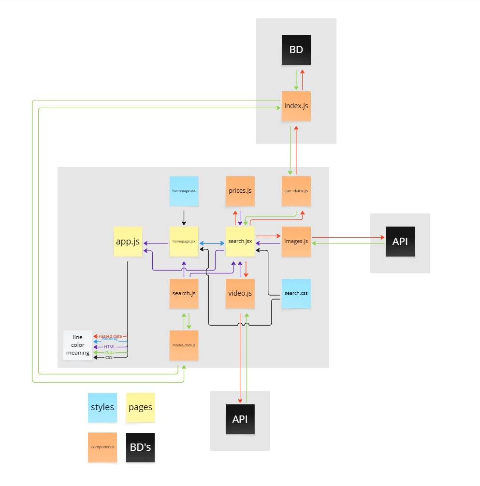

# Car-Jockey

**Author:** Miguel Campos

Car-Jockey is a work-in-progress project that combines a React frontend and a Node.js backend. The goal is to provide users with a smooth experience searching for car information, videos, images, and price data.

> ⚠️ This repository is actively under development. Features, APIs, and components may change frequently.

## Project Structure

- `client/` – React application with components for search, video playback, images, and prices.
- `backend/` – Simple Node.js API (currently just an `index.js`).
- `docs/` – Documentation and architecture diagrams.

## Architecture



The image above illustrates the high-level structure of the system, showing how the frontend interacts with external APIs and the backend service.

## Development Setup

1. Clone the repository.
2. Install dependencies in both `client` and `backend` folders:
   ```bash
   cd client && npm install
   cd ../backend && npm install
   ```
3. Create a `.env` file in the `client` directory to store any API keys (see `.env.example` for a template). **Do not commit `.env`.**
4. Define backend configuration variables as well. You can set the following in your shell or a `.env` file consumed by your start script:
   ```bash
   # examples
   DB_HOST=localhost
   DB_USER=root
   DB_PASSWORD=admin
   DB_NAME=car_jockey
   ```
5. Start the frontend and backend servers separately:
   ```bash
   cd client && npm start
   cd ../backend && node index.js
   ```

### Environment Variables

- Frontend uses `REACT_APP_YOUTUBE_API_KEY` and `REACT_APP_UNSPLASH_API_KEY`.
- Backend uses `DB_HOST`, `DB_USER`, `DB_PASSWORD`, and `DB_NAME` (defaults are provided for development). 

Never commit real API keys or credentials. Keep them in a local `.env` file or your environment and use `.env.example` as a safe template.

## Notes

- Please treat this repository as experimental; some components may still contain hardcoded values or require refactoring.
- Contributions are welcome, but coordinate before making major changes.

---

*Created and maintained by the project author.*
